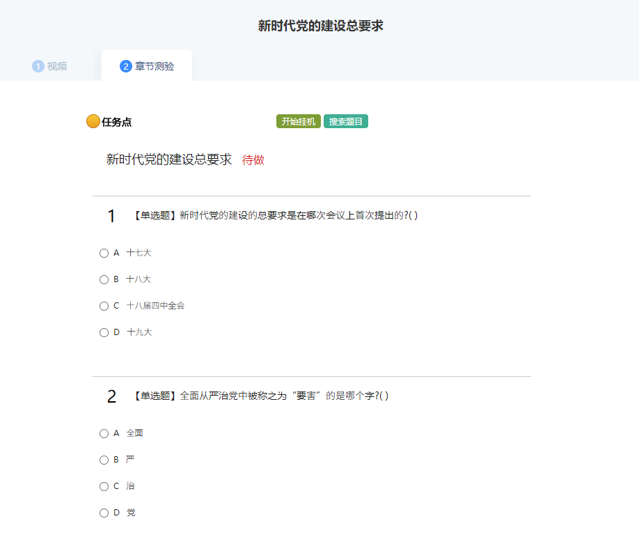
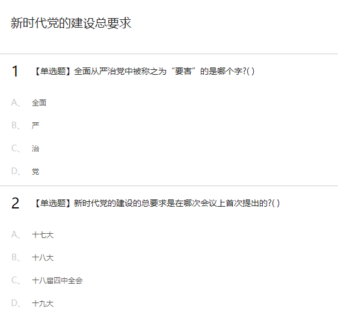

## 简介

学习通搜题脚本手动版本，浅学了一下 js 写的油猴脚本

由于不需要刷视频等那么多功能，只需要搜指定题，然后最近学习通对题目进行了加密，大部分刷题脚本无效了，但使用 ocr 识图过于麻烦，心血来潮写的项目

一切需要手动操作，思路来源于 KirigiriSuzumiya 大佬的开源项目：[XueXiTong_web](https://github.com/KirigiriSuzumiya/XueXiTong_web)，如果需要自动操作可以 star 大佬的项目

## 原理

https://mooc1.chaoxing.com/api/selectWorkQuestion?workId=000000&courseId=0000000

补全上述网址的 workId 和 courseId 参数，可以得到未加密的明文

感谢大佬的思路：[【新】【非OCR识别】学习通破解章节测试文字乱码思路](https://bbs.tampermonkey.net.cn/thread-2190-1-1.html)

题库采用的是 CodFrm 大佬的网页版搜题：https://cx.icodef.com/query.html

## 使用

分别添加三个脚本，点击章节测验

会自动打开一个新的界面，显示出题目的明文，但是题目和答案的顺序可能不一样！！！

点击题目（光标不显示可点击光标，但可以点）会自动打开题库并进行检索相应题目，得到答案（存在bug，建议使用下面这种）
复制题目文字，会自动打开题库界面并进行检索

